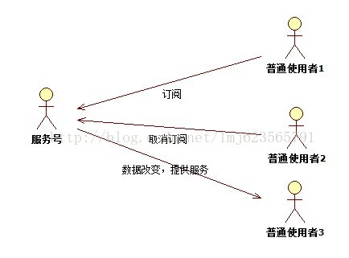
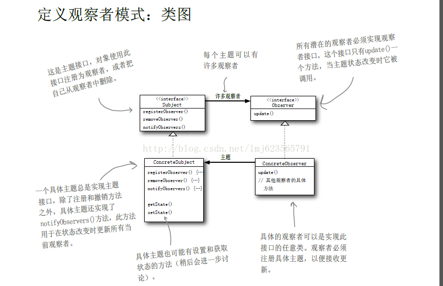

观察者模式
=== 
## 定义
    定义了对象之间的一对多的依赖，这样一来，当一个对象改变时，它的所有的依赖者都会收到通知并自动更新
    如今的微信服务号相当火啊，下面就以微信服务号为背景，给大家介绍观察者模式
### 看下图

### 如上图所示，服务号就是我们的主题，使用者就是观察者。现在我们明确下功能：
1. 服务号就是主题，业务就是推送消息

2. 观察者只需要订阅主题，只要有新的消息就会送来

3. 当不想要此主题消息时，取消订阅

4. 只要服务号还在，就会一直有人订阅

### 观察者模式的类图：

